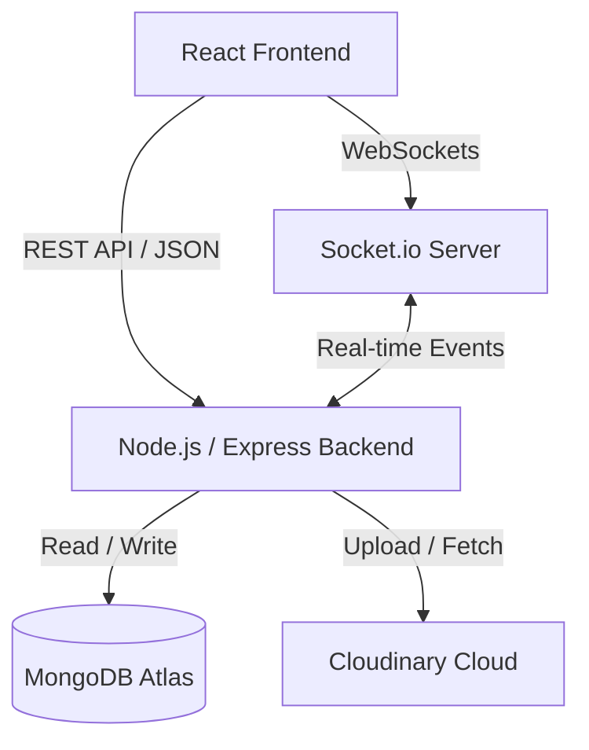

<div align="center">

# 🌐 LinkUp - The Ultimate Social Experience


<br/>

[](https://reactjs.org/)
[](https://nodejs.org/)
[](https://www.mongodb.com/)
[](https://expressjs.com/)
[](https://socket.io/)
[](https://chakra-ui.com/)

**A full-stack, real-time social media application inspired by modern platforms, providing a seamless and engaging user experience.**

[Report Bug](https://github.com/pranavpanmand/linkup-social-media/issues) · [Request Feature](https://github.com/pranavpanmand/linkup-social-media/issues)

</div>

---

## 📋 Table of Contents
- [✨ Key Features](#-key-features)
- [🛠️ Technology Stack](#️-technology-stack)
- [🏗️ System Architecture](#️-system-architecture)
- [🚀 Quick Start Guide](#-quick-start-guide)
- [🔑 Environment Variables](#-environment-variables)
- [📸 Application Previews](#-application-previews)
- [🤝 Contributing](#-contributing)
- [👨‍💻 Author](#-author)

---

## ✨ Key Features

### 🔐 Secure & Seamless Authentication
- **JWT & HTTP-Only Cookies:** Fortified session management ensuring your data remains secure.
- **Bcrypt Encryption:** Bulletproof password hashing for complete peace of mind.

### 👥 Interactive Social Graph
- **Dynamic Profiles:** Customize your persona with avatars and biographies.
- **Follow System:** Curate your personalized feed by following and unfollowing users in real-time.

### 📝 Rich Post Engagement
- **Multimedia Posts:** Share your thoughts through text or high-quality images stored securely on Cloudinary.
- **Engagement Tools:** Like, comment, and interact with the community effortlessly.

### ⚡ Lightning-Fast Real-Time Chat
- **Socket.io Integration:** Instantaneous messaging with zero lag.
- **Read Receipts:** "Seen" status lets you know exactly when your messages are read.
- **In-Chat Media:** Share images directly inside your direct messages.
- **Audio Alerts:** Satisfying notification sounds keep you in the loop without needing to refresh.

### 🎨 Beautiful, Modern UI/UX
- **Dark & Light Themes:** First-class support for both themes, toggled instantly.
- **Framer Motion:** Silky smooth page transitions and micro-animations.
- **Command Palette (`Ctrl+K`):** Power user navigation to jump anywhere in the app instantly.
- **Responsive Design:** Looks incredible on desktops, tablets, and smartphones.

---

## 🛠️ Technology Stack

<details>
<summary><b>Frontend (Client)</b></summary>
<br>

- **Core:** [React.js](https://reactjs.org/) (Vite built)
- **Styling:** [Chakra UI](https://chakra-ui.com/) (Component Library)
- **State Management:** [Recoil](https://recoiljs.org/)
- **Animations:** [Framer Motion](https://www.framer.com/motion/)
- **Real-Time Client:** [Socket.io-client](https://socket.io/)
- **Routing:** [React Router DOM](https://reactrouter.com/)

</details>

<details>
<summary><b>Backend (Server)</b></summary>
<br>

- **Environment:** [Node.js](https://nodejs.org/)
- **Framework:** [Express.js](https://expressjs.com/)
- **Database:** [MongoDB](https://www.mongodb.com/) with [Mongoose](https://mongoosejs.com/)
- **Real-Time Engine:** [Socket.io](https://socket.io/)
- **Image Hosting:** [Cloudinary](https://cloudinary.com/)
- **Security:** [JSON Web Tokens (JWT)](https://jwt.io/) & [Bcrypt.js](https://www.npmjs.com/package/bcryptjs)
- **Task Scheduling:** [Cron](https://www.npmjs.com/package/cron)

</details>

---

## 🏗️ System Architecture



---

## 🚀 Quick Start Guide

Follow these instructions to set up the project locally on your machine.

### Prerequisites
Make sure you have installed:
- **Node.js** (v16.x or newer)
- **Git**
- A **MongoDB** database (Local or Atlas)
- A **Cloudinary** account

### 1. Clone the Repository
```bash
git clone https://github.com/pranavpanmand/linkup-social-media.git
cd linkup-social-media
```

### 2. Install Dependencies
You need to install dependencies for both the frontend and backend.
```bash
# Install backend dependencies
cd backend
npm install

# Install frontend dependencies
cd ../frontend
npm install
```

### 3. Start the Development Servers
Open two terminal windows/tabs to run the client and server concurrently.

**Terminal 1: Backend**
```bash
cd backend
npm run dev
```

**Terminal 2: Frontend**
```bash
cd frontend
npm run dev
```
Your application will now be running at `http://localhost:3000`.

---

## 🔑 Environment Variables

To run this project, you will need to add the following environment variables to your `.env` file located in the `backend` directory.

```env
PORT=5000
MONGO_URI=mongodb+srv://<username>:<password>@cluster.mongodb.net/linkup
JWT_SECRET=generate_a_strong_random_secret_string
CLOUDINARY_CLOUD_NAME=your_cloudinary_name
CLOUDINARY_API_KEY=your_cloudinary_api_key
CLOUDINARY_API_SECRET=your_cloudinary_api_secret
NODE_ENV=development
```

---

## 📸 Application Previews
*(Replace these placeholders with actual screenshots of your application)*

<div align="center">
  
  
  <br/><br/>
  
  
</div>

---

## 🤝 Contributing

Contributions are what make the open source community such an amazing place to learn, inspire, and create. Any contributions you make are **greatly appreciated**.

1. Fork the Project
2. Create your Feature Branch (`git checkout -b feature/AmazingFeature`)
3. Commit your Changes (`git commit -m 'Add some AmazingFeature'`)
4. Push to the Branch (`git push origin feature/AmazingFeature`)
5. Open a Pull Request

---

## 👨‍💻 Author

<div align="center">
  <b>Pranav Panmand</b>
  <br>
  <a href="https://github.com/pranavpanmand">GitHub</a> • <a href="https://www.linkedin.com/in/pranavpanmand">LinkedIn</a>
  <br><br>
  <i>Show some ❤️ by starring this repository!</i>
</div>
